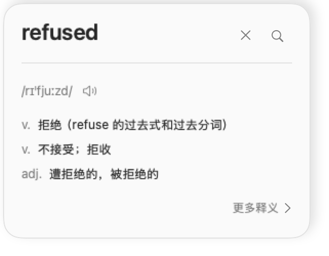
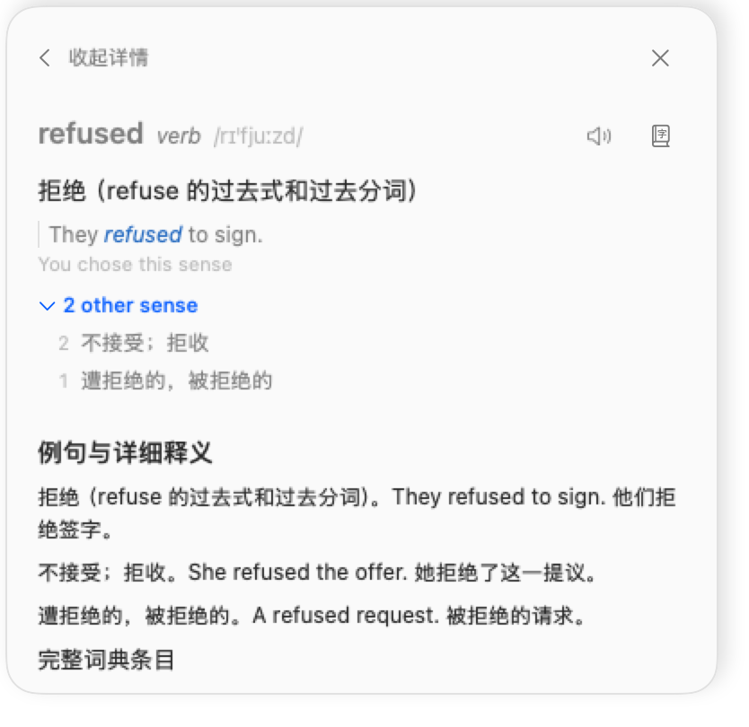
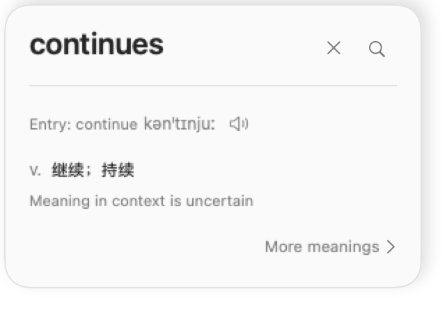

# Compact lookup design QA

Final result: native view passed; the complete local HuiDict build and installation are verified.

The visual comparison passes. The target is Hui's supplied `refused` lookup screenshot. The
implementation is the actual native SwiftUI card rendered with synthetic bilingual fixture data.
The reference and implementation were placed together in a normalized comparison image before
review. No actionable P0, P1, or P2 visual issues were found in this comparison.

The card surface is 300 points wide at the standard text size, matching the reference. Its outer
frame, including the transparent shadow margin, is 321 × 250 points. The word is prominent,
pronunciation sits below a divider, definitions are short, and `More meanings` is at the lower
right. Simplified Chinese localization displays `更多释义`. The neutral surface and shadow work
in light and dark appearances. A larger text setting produces a 401 × 295 point outer frame.

The reference's favorite star is omitted for the requested lookup-focused flow. Pronunciation
comes from the dictionary; the card does not invent separate regional readings. Dictionary form
and near-match cues remain available. Uncertain meanings retain a short visible caveat.

Expansion reveals every meaning, the captured context, publisher sense text including examples,
dictionary switching, and the existing study actions. Long details scroll within the existing
height cap. The expanded fixture has a 417 × 405 point outer frame. The same panel can collapse
again, and a new request starts compact.

## Validation

- 109 focused Swift tests passed, including compact summary behavior, uncertainty preservation,
  definition deduplication, native layout, larger text, height limits, existing selection behavior,
  control wiring, source string coverage, and design token checks.
- Native renders were inspected in compact, expanded, large-text, and dark states.
- After Hui approved opening the local fixture preview, live native UI checks passed: More meanings
  expanded the same card, details scrolled to the existing actions, collapse restored the compact
  view, a new request reset the disclosure, and close ended the preview. These checks exercised
  the actual views with fixture data; they did not exercise dictionary or model services.
- Swift syntax parsing and `git diff --check` passed.

These are view-only checks, not a production build. They used an isolated temporary package with
the installed macOS 26.5 SDK. Three environment macros were expanded into equivalent environment
keys; Xcode canvas previews and on-device generation were omitted. The SDK's model error naming
was adapted in the harness. Production source, signing, and model behavior were not changed for
this workaround. The app target also compiled in that harness.

Three catalog infrastructure tests were excluded: two depend on the full package's source layout,
and the catalog compilation test requires the unavailable `xcstringstool`.

## Complete local app verification

Xcode 27.0 (27A266a), Swift 6.4 and Apple's Metal Toolchain are installed. The actual package now
builds against the macOS 27 SDK with its Foundation Models and SwiftUI compiler plugins. No view
workarounds are used in the packaged app.

- All seven Swift test targets passed, reporting 2,020 tests. Tests for optional sideloaded
  dictionaries skip with explicit fixture requirements when absent. Upstream Developer ID bundle
  tests skip because that separately signed release is not built here.
- All 65 Python tool tests passed, including actual icon compilation and rendering. The Chinese
  string catalog compiled, and the separate HuiDict icon name was verified.
- `.build/HuiDict.app` is an optimized local build containing both XPC services, all required model
  resource bundles, Metal shaders, translations and third-party notices. Bundle metadata, service
  boundaries, hardened runtime signatures and sealed resources passed verification.
- The local identity is `com.linhui.huidict`. Services pin the exact signed host code; the host
  pins its bundled services. Real XPC tests accepted the correct process and rejected incorrect
  code hashes and signing identifiers. Unsigned and modified resource bundles were refused.
- The installed copy at `~/Applications/HuiDict.app` passed deep signature verification, and all
  three executable hashes matched the built copy. Its actual dictionary service returned Oxford
  English–Chinese entries for `refused` in 124 ms; its model service executed a GPU operation.
- The existing primary dictionary choice was copied to HuiDict. HuiDict has separate preferences,
  history and model storage, and its local build does not require a paid Developer ID.

## Installed HuiDict UI verification

On 2026-10-01, Hui approved opening the installed app. Its setup board reported Accessibility,
Screen Recording and the Oxford English–Chinese dictionary ready. The original XiaolaiDict was
still running and held the default shortcut. After Hui quit that app, opening and cancelling
HuiDict's shortcut recorder restored the existing Control + Option + D registration; the setup
board then reported it ready. The optional 3.06 GB model download was deferred for word lookup.

Hui manually triggered Option-hover and left the card visible. Native UI inspection verified a
real `offer` lookup from TextEdit, with pronunciation and short Chinese meanings from the actual
dictionary service. More meanings expanded the same panel to its other senses, captured context
and publisher examples. Fewer details restored the compact view. The expanded content scrolled
to the dictionary selector and existing study actions within the height cap. A subsequent
`invitation` lookup reset the expanded panel to the compact view. Close lookup dismissed the
window while HuiDict stayed running.

The automation tool's simulated global shortcut entered a control character in the temporary
TextEdit sample instead of invoking the hot key, so shortcut registration is verified but its
physical-key behavior is not. Option-hover was triggered by Hui; the card and disclosure controls
were inspected and operated through native accessibility automation. The temporary sample text
was restored after the test. The setup window still carries the upstream name in its title.

The installed bundle passed signature, resource and service verification again after launch.
The local app is not notarized for public distribution.

## Grouped compact grammar refinement

Final result: passed native rendering, focused tests and live shortcut checks; rebuilt and installed locally.

Hui's `continues` screenshots identified redundant transitive and intransitive verb labels.
The compact view now abbreviates both as `v.`, groups meanings under one part-of-speech label,
and removes duplicate definitions across those verb variants before applying the three-meaning
preview limit. Meanings with distinct parts of speech remain in separate groups. Original sense
keys, grammatical labels, selection standing and all detailed meanings are preserved.

The native `continues` fixture now shows `v. 继续；持续` once instead of three verb rows. The
standard outer frame is 321 × 224 points; larger text is 401 × 262 points. Light, dark and larger
text renders were inspected. The uncertainty cue and More meanings remain visible.

- 23 focused Swift tests passed, including duplicate removal across verb variants, grouping,
  confirmed-sense priority, separate parts of speech, unchanged detailed sense data, disclosure
  selection and native layout at larger text sizes.
- The optimized local app was rebuilt as `2026.1001.72326`. Bundle verification passed, and its
  real dictionary service returned entries for `continues`. The installed copy passed the same
  verification, matched all three rebuilt executable hashes and returned the lookup in 114 ms.
- The installed update preserves the previous signed app in
  `.build/huidict-install-backups/2026.1001.44832/HuiDict.app`. Its two installation moves were
  recorded in the IT Guy undo manifest before replacement.

The live control checks in the preceding section describe the previous installed build. The
grouped refinement was verified through actual SwiftUI renders and focused tests. Hui approved
reopening it. A physical Control + Option + D lookup now opens the actual `continues` card with
`v. 继续；持续；继续走` on one line. More meanings reveals the original grammatical labels,
all other senses, context and publisher examples; Fewer details restores the compact view.
A second physical shortcut lookup of `discussion` opened without another permission prompt and
reset the expanded view to the compact `n.` summary. Close dismissed the lookup window.

### Accessibility authorization recovery

The rebuilt app initially reported missing Accessibility access despite its existing enabled
switch. Hui approved restoring both lookup permissions. Toggling the existing entry and restarting
did not fix the denial. Removing HuiDict's Accessibility entry, adding the exact installed path
`~/Applications/HuiDict.app`, and restarting did: Hui's physical shortcut opened a real lookup
without the authorization error. Screen Recording remained enabled; its entry was not removed.

The previous and current ad-hoc signatures have different designated requirements, each tied to
its own code hash. This is consistent with the old grant not applying to the rebuilt app. Apple
documents that ad-hoc signing cannot preserve privacy authorization across different builds:
[TN3127: Inside Code Signing: Requirements](https://developer.apple.com/documentation/technotes/tn3127-inside-code-signing-requirements).
The current grant is refreshed, but future rebuilt versions may require a fresh grant. A stable
certificate-based signing identity has not been configured.
