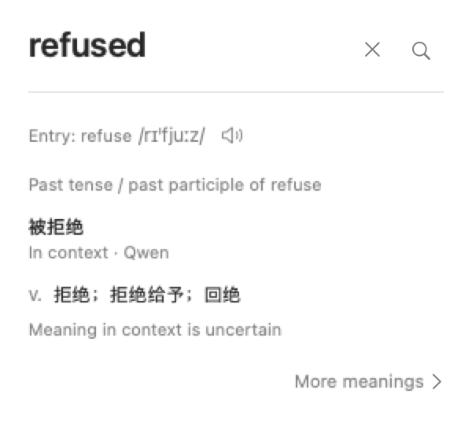

# Translation upgrade verification

Verified on 2026-10-01 with HuiDict build `2026.1001.91638` and the existing local
Qwen3.5 4B model. No model download was performed.

The compact card now shows a generated Chinese word gloss separately from dictionary senses.
Its surrounding sentence determines the reading. Isolated inflected words can show multiple
readings, and a word-form note explains the relationship to the dictionary headword.
HuiDict sentence translations and usage explanations also target Simplified Chinese.

## Checks

- The full Swift test suite passed: 2,031 tests reported across seven targets. Tests requiring
  optional sideloaded dictionary fixtures were skipped.
- Native card layout passed at standard and large text sizes in light and dark appearance.
- The built and installed bundles both passed all nine Qwen checks below.
- All seven word glosses were identical between the two runs. Sentence translations and
  explanations retain sampling for natural prose.
- The installed app passed bundle metadata, signature, resource, and embedded-service verification.
  Its host executable SHA-256 matched the verified build:
  `8754315a4ff636344d385005bf2eab60bb930a1ed1a3a4c782f06d35fa0192c8`.
- The previous installed app was retained as a rollback copy, with a move manifest written before installation.

| Selected text or task | Context | Installed Qwen result |
| --- | --- | --- |
| refused | The application was refused. | 被拒绝 |
| refused | They refused to sign. | 拒绝 |
| refused | No surrounding sentence | 拒绝；被拒绝 |
| approach | Sometimes an approach that requires more lines of code is actually simpler, because it reduces repetition. | 方法；途径 |
| continues | The discussion continues. | 继续 |
| denied | Her request was denied. | 被拒绝 |
| Sentence translation | The application was not refused. | 该申请并未被拒绝。 |
| approach with a mismatched hint | This approach reduces repetition in the code. Hint: something similar. | 方法 |
| Usage explanation with that hint | Same sentence, requested in Simplified Chinese | Explained approach as a noun meaning a method or strategy for reducing code repetition. |

These examples verify the identified grammatical and contextual cases, not translation accuracy
across arbitrary text. An unavailable, invalid, or oversized generated word gloss leaves the
dictionary preview available. Generated text never receives a dictionary key or a saved sense confirmation.

## Native card render



This is an offscreen native SwiftUI render with a supplied gloss, not a live lookup screenshot.
The model checks above run through the real bundled service. The global shortcut and Option-hover
capture path are outside this headless verification.

## Reproduce

```sh
swift test --scratch-path .build/huidict-swift -Xswiftc -DHUIDICT_LOCAL_BUILD
HUIDICT_LOCAL_BUILD=1 Tools/build-bundle.sh build
.build/HuiDict.app/Contents/MacOS/HuiDict --word-translation-report
```

The report requires an already installed model and fails without downloading one if none is present.
