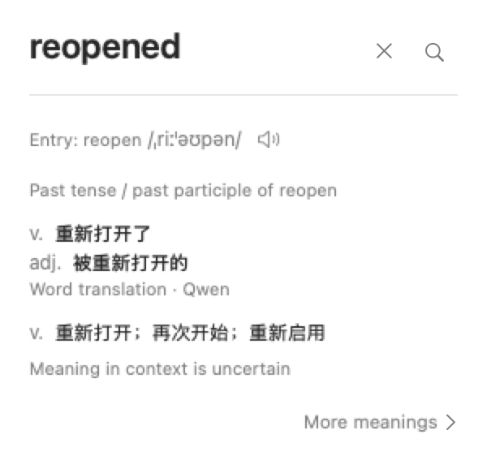

# Grammar labels for generated word translations

Qwen's compact word gloss now includes a part-of-speech label beside each reading. The model
returns grammar and translation as separate structured fields. The app renders familiar labels
such as `n.`, `v.`, and `adj.`; it does not copy the dictionary entry's grammar onto generated text.

A surrounding sentence requests one contextual reading. Without a sentence, the model can return
up to three common readings, grouped by part of speech. Synonyms with the same grammar share one
row. A passive verb remains `v.`; an adjectival use receives `adj.`. Inflected word forms remain
visible above these readings, and dictionary senses remain separate below them.

Missing labels, empty or oversized answers, and untranslated echoes are rejected. An unavailable
generated gloss leaves the dictionary preview available. Generated readings do not receive
dictionary keys or become confirmed dictionary senses.

## Native card layout



This is a native SwiftUI render with supplied readings. Layout checks cover standard and large
text sizes in light and dark appearance. It is separate from the real model verification.

## Verified model results

Build `2026.1001.111354` passed all 13 real-model checks in two fresh processes on October 1
using the existing local Qwen model, without a download. The full Swift suite reported 2,047
passing tests across seven
targets; optional dictionary fixtures and stale pre-build bundle fixtures were skipped. The
completed bundle passed strict signature checks and both update-identity compatibility gates.

| Selected word | Context | Qwen readings |
| --- | --- | --- |
| reopened | No surrounding sentence | `v. 重新打开` and `adj. 重新打开的` in the second run |
| reopened | They reopened the shop. | `v. 重新打开` |
| reopened | The shop was reopened yesterday. | `v. 重新开业` |
| reopened | The newly reopened shop is busy. | `adj. 重新开业的` |
| refused | No surrounding sentence | `v. 拒绝` and `adj. 被拒绝的` in both runs |
| approach | An approach that reduces code repetition | `n. 方法` |

The other checks cover active and passive `refused`, `continues`, `denied`, a mismatched dictionary
hint, sentence negation, and a contextual usage explanation. Generated wording can vary between
runs; the report checks grammar and expected meaning rather than exact wording.

Verified host SHA-256:
`ee482775b00d4afa22a1fb9f2ee1b172eb61f2b1eed45afe571180c34c785194`.

The installed host matches that verified bundle and was replaced atomically with rollback copies
retained. Its signing certificate and designated requirement are unchanged; no privacy permission
was reset or re-granted. Three fresh terminal diagnostics reported both grants, but terminal
attribution alone does not prove the GUI app's saved permissions.

The subsequent installed-copy model check was blocked by available memory below the model's
4.83 GB loading requirement, not by a translation or grammar failure. The memory guard remains
intact. The installed check remained memory-blocked after opening the GUI app.

Native automation reported `Sky Computer Use native pipe startup failed`, so Hui manually opened
the installed app. At 19:19:19 on October 1, HuiDict process `75875` was the responsible process
for TCC decisions of `Allowed (System Set)` for both Accessibility and Screen Recording, with
`DB Action:None`. macOS accepted the unchanged certificate-based requirement with status `0`.
This verifies the GUI app retained its own grants after the update without resetting permissions.
An additional GUI restart, shortcut test, and Option-hover test were not performed in this check.

## Reproduce the model check

```sh
DEVELOPER_DIR=/Applications/Xcode.app/Contents/Developer make local
.build/HuiDict.app/Contents/MacOS/HuiDict --word-translation-report
```

The report uses an already installed local model and does not download one. Its examples check
selected grammatical readings, not accuracy across arbitrary text.
